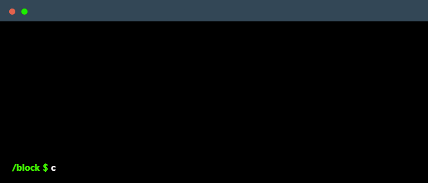

 

    

### My mission
I am a passionate Minecraft mod developer, always looking for creative and innovative solutions. With a strong technical background, I dedicate myself to turning ideas into engaging features, enhancing the gaming experience for the community. My mission is to create connections, foster collaboration, and develop content that makes the world of Minecraft even more dynamic and exciting.
### Main skills

### Publications

  
  

### Connect with me!

    

